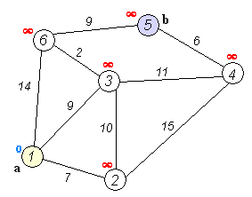

<h1 align="center">
  <br>
  <a href="#"></a>
  <br>
  UTEC Graphs
  <br>
</h1>
<p align="center">
  
  
  
  
  
</p>

<h1 align="center">
  <a href="#"></a>
</h1>


## Integrantes
|   Apellidos y Nombres    |           Email               |
|--------------------------|-------------------------------|
| Morales Panitz, Alexander| alexander.morales@utec.edu.pe |
| Ugarte Quispe, Grover    | grover.ugarte@utec.edu.pe     |
| Bracamento Otiniano, Eric| eric.bracamonte@utec.edu.pe   |

----
El proyecto del curso consiste en implementar una estructura de datos de grafo y un file parser. 

### Tipos de grafo
#### Dirigido

Son grafos cuyas aristas indican hacia que sentido es posible travesar de un nodo a otro.

```cpp
template <typename TV, typename TE>
class DirectedGraph;
```

#### No dirigido

Son grafos cuyas aristas no especifican hacia que sentido es posible travesar de un nodo a otro.

```cpp
template <typename TV, typename TE>
class DirectedGraph;
```

#### Implementación

Para que nuestros algoritmos puedan acceder a todos los miembros de los grafos, fue necesario agregarlos como funciones amigas dentro de la clase y una declaración en el archivo de la clase.

**Declaración en archivo.h**

```cpp
template <typename TV, typename TE>
DirectedGraph<TV, TE> dijkstra(DirectedGraph<TV, TE> &, string);
```

**Declaración dentro de definición de clase**

```cpp
template <typename T, typename E>  
friend DirectedGraph<T, E> dijkstra(DirectedGraph<T, E> &, string);
```

### Methodos:

```cpp
bool insertVertex(string id, TV data); // Creates a new vertex in the graph with some data and an ID

bool createEdge(string start, string end, TE data); // Creates a new edge in the graph with some data

bool deleteVertex(string id); // Deletes a vertex in the graph

bool deleteEdge(string start, string end); // Deletes an edge in the graph, it is not possible to search by the edge value, since it can be repeated

TE &operator()(string start, string end); // Gets the value of the edge from the start and end vertexes

float density(); // Calculates the density of the graph

float isDense(float threshold = 0.5); // Calculates density using threshold

bool isDense(float threshold = 0.5); // Calculates the density of the graph, and determine if it is dense dependening on a threshold value

bool isConnected(); // Detect if the graph is connected (creado solo para grafos no dirigidos)

bool isStronglyConnected(); // Detect if the graph is strongly connected (creado solo para dirigidos)

bool empty(); // If the graph is empty

void clear(); // Clears the graph

void displayVertex(string id); //Displays edged from id vertex

bool findById(std::string id) = 0; //Returns true if id vertex is on graph

void display(); //Displays edges from all vertexes

```

### Algorithms:

#### Algoritmo Dijkstra
Busca la distancia más corta de un vértice a todos los demas. Va agarrando el nodo con la distancia mínima del padre, lo visita y luego ve a sus vecinos. Si la distancia para ir a un vecino desde el nodo elegido es menor a la distancia actual, se cambia la distancia y se elije un nuevo padre.



Este algoritmo funciona para grafos dirigidos y no dirigidos.

Presenta una complejidad de $O(|E|+|V|\log|V|)$

```cpp

template <typename TV, typename TE>
DirectedGraph<TV, TE> dijkstra(DirectedGraph<TV, TE> &g, string start_node);

template <typename TV, typename TE>
UnDirectedGraph<TV, TE> dijkstra(UnDirectedGraph<TV, TE> &g, string start_node)

```

En nuestra implementación, se retorna un grafo dirigido o no dirigido que es un arbol con las distancias minimas del nodo inicial a los demás. 

#### Algorithmo Floyd-Warshall

Utiliza dos matrices de distancias y padres. Tiene 3 bucles anidados. En el primero de elije un vértice y en los siguientes se recorre todas las combinaciones de vertices preguntando si la distancia de ir de A a B es menor utilizando el vertice elegido del primer bucle. 


Este algoritmo funciona para grafos dirigidos y no dirigidos.

Presenta una complejidad de $O(|V|³)$

```cpp
matrix_square_pair<TE> floyd_warshall(DirectedGraph<TV, TE> &g);

matrix_square_pair<TE> floyd_warshall(UnDirectedGraph<TV, TE> &g);
```

En nuestra implementación, se retorna un par de matrices. La primera tiene los padres y la segunda las distancias.


#### Algoritmo Belman-Ford 
Consta de un algoritmo con el objetivo de encontrar la ruta más corta entre un nodo y los restantes. Al igual que el algoritmo Dijkstra, se basa en la comparación de distancias y asignación de padres. La única diferencia es que la evaluación de aquello se realiza mediante la iteración de todas las aristas en el grafo por una cantidad $|V|-1$. Ya que no depende de la partida de vertices, es posible trabajar con grafos con pesos negativos. 


Este algoritmo es principalmente utilizado con grafos dirigidos, ya que si se tratase de aplicar en un grafo no dirigido y este contase con una arista de peso negativa, existiría un bucle que tras cada iteración ocasionaría la disminución en la distancia. 

Presenta un complejidad de $O(|E|*|V|)$.

```cpp
template <typename TV, typename TE>
DirectedGraph<TV, TE> bellman_ford(DirectedGraph<TV, TE> grafo, const string &nodoInicio);
```

En nuestra implementación, se retorna un grafo dirigido el cual presenta las aristas que permiten el menor peso para llegar a todos los vértices.

#### Algoritmo Kruskal
Consta de un algoritmo para hallar un árbol mínimo de expansión en un grafo. Se basa en recorrer las aristas de forma ascendente dependiendo de sus pesos sin crear ciclos en el proceso. Esto se realiza mediante un disjoint set.


Presenta un complejidad de $O(E\log V)$

```cpp
template <typename TV, typename TE>
UnDirectedGraph<TV, TE> kruskal(UnDirectedGraph<TV, TE> grafo)
```

En nuestra implementación, considerando de que Kruskal puede identificar ciclos en grafos dirigidos cuando las direcciones determinan lo contrario, entonces solo se retornará un grafo no dirigido.

#### Algoritmo Prim

Es un algoritmo de obtención de un árbol de expansión mínima el cual se enfoca en aglomerar a un grafo las aristas con menor tamaño tras recorrer vértices por media de las aristas. Sabiendo que no se deben formar ciclos, requerimos la ayuda de un disjoint set.


Su complejidad es $O(V^2)$.

```cpp
template <typename TV, typename TE>
UnDirectedGraph<TV, TE> prim(UnDirectedGraph<TV, TE> grafo, string inicio);
```

Sabiendo que solo se pueden recorrer vértices si existe una conexión dirigida entre ellos, existen casos donde no será posible llegar a todos los vértices. Por ende, no podrá obtenerse un arbol de expansión mínima. Por ese motivo, solo se utiliza para el caso de grafos no dirigidos.

#### Algoritmo A*

Es un algoritmo de busqueda basado en heurísticas para hallar la menor distancia entre dos vértices seleccionados. Presenta un método de resolución similar a Dijkstra, con la diferencia de que solo se expande en sus nodos cercanos y utiliza una heurística (aproximación) hacia el nodo final de tal forma que pueda tomar un camino óptimo sin consultar una mayor cantidad de vértices.


```cpp
template <typename TV, typename TE>
deque<distance_pair<TE>> astar(DirectedGraph<TV, TE> &gr, unordered_map<string, TE> &h, string start_node, string end_node);
```

#### Algoritmo Depth-First-Search

Empleamos este algoritmo de tal manera que podamos obtener un árbol con todos los nodos. La forma en que este algoritmo surca el grafo es por medio de explorar el máximo hijo de una rama, marcandolo como ya visitado y dirigirse hacia el siguiente hijo máximo. En el momento que no existe hijos máximos, se realiza backtracking para hallar el padre. Este procedimiento se realiza hasta que todos los nodos hayan sido recorridos.


```cpp
template <typename VertexType, typename EdgeType>
UnDirectedGraph<VertexType, EdgeType> DFS(UnDirectedGraph<VertexType, EdgeType> *graph, std::string start_node);

template <typename VertexType, typename EdgeType>
DirectedGraph<VertexType, EdgeType> DFS(DirectedGraph<VertexType, EdgeType> *graph, std::string start_node);
```

## JSON file parser (graph_json)
- Esta clase tiene guardado como atributo un json con un grafo con cierta codificacion:

```json
 {

  "0":{
    "connections": [["1",41],["2",50],["3",40]],
    "data" : 0
  },
  "1":{
    "connections" : [],
    "data": 1

  },
  "2":{
    "connections": [["0",50]],
    "data":2
  },
  "3":{
    "connections": [["1",40]],
    "data": 3
  }

}

```
Por cada nodo tiene un json con dos propiedades "connections y "data". El primero es un vector de pares con el nodo que se conecta y su peso. El segundo es el valor que tiene el nodo internamente, se usa como la información guardada del vértice (esta información de tiene que pasar como parámetro en la inserción de un vertice).

### Metodos

```cpp
void readJson(string js); //lee una string de un grafo con la codificación respectiva y lo guarda en un json interno

void clear(); //limpia el json interno

void uGraphMake(UnDirectedGraph<TV, TE> &tempGraph); // Recibe un grafo no dirigido, lo limpia y luego inserta la información del json interno

void dGraphMake(DirectedGraph<TV, TE> &tempGraph); // Recibe un grafo dirigido, lo limpia y luego inserta la información del json interno
```

Para el json interno se utilizo a la librería <a href="https://github.com/nlohmann/json">nlohmann<a/>.


### Methods:
```cpp
void clear(); // Clears parser saved atributes

void readJSON(); // Parses JSON file and saves data into class
// NOTE: each derived class has its own readJSON method

void uGraphMake(UndirectedGraph<string, double> &tempGraph); // Adds the parsed data into the specified undirected graph

void dGraphMake(DirectedGraph<string, double> &tempGraph); // Adds the parsed data into the specified directed graph
```
# How to use this repo
```
$ g++ main.cpp && ./a.out
```
